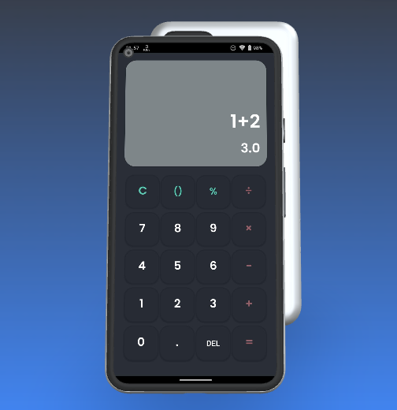

# Calculator

Calculator is a Kotlin app for performing various mathematical calculations.

## Introduction

This project marks the beginning of the application's development journey. I am committed to continuous improvement to make this calculator app even better in the future.

## Features

- Perform various mathematical calculations with ease.
- Built with Kotlin to provide a seamless and efficient user experience.

## Screenshots

## Get Started

To get started with the Calculator app, follow these steps:

1. Clone this repository to your local machine.
2. Install Kotlin if you haven't already.
3. Run your Kotlin code using your preferred development environment.

## Contributions

Contributions to the Calculator app are always welcome. If you'd like to improve the app, fix bugs, or add new features, please feel free to fork the repository and submit a pull request.

## Feedback

If you have any feedback, suggestions, or encounter issues, please open an issue on this repository. Your input is greatly appreciated and helps make the Calculator app better.
